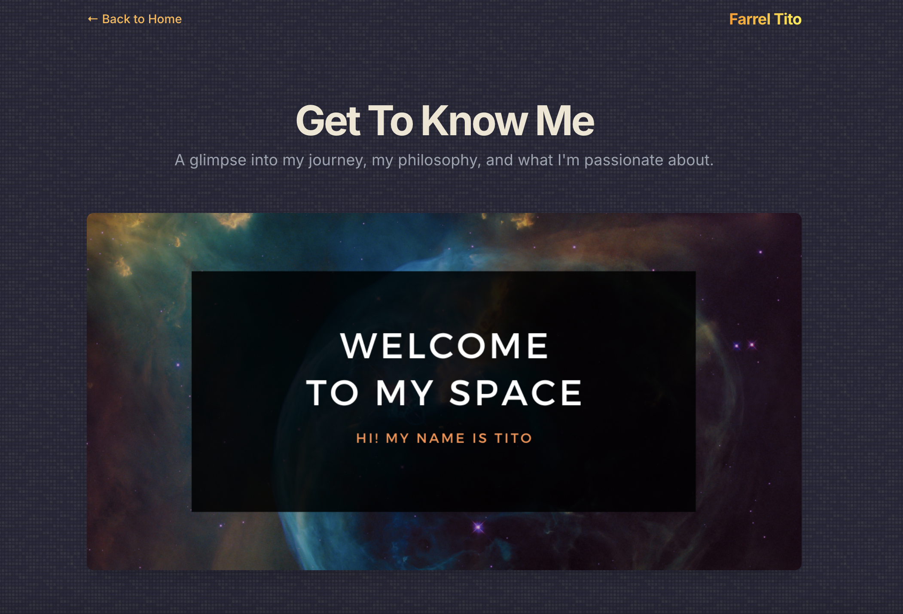

[Link to my portfolio page click here...](https://farreltito.netlify.app/)

# Personal Portfolio Website for Farrel Tito
## Overview
This repository contains the source code for the personal portfolio website of **Farrel Arghya Tito Prayoga**, a passionate developer and Informatics Fresh Graduate. The website is designed to showcase **Farrel Tito** skills, journey into technology, and selected projects in a clean, modern, and visually appealing format.

The design is inspired by a custom "**Yoimiya from Genshin Impact**" color theme, featuring a dark mode aesthetic with vibrant, warm accents. The site is fully responsive and built with semantic HTML and modern CSS practices.

## Skills Implemented

## What I Use?

## Features Implemented
- 2-Page Structure:
    - A main **Homepage** (`index.html`) featuring a main section, social links, a brief "About Me" summary, and a placeholder for projects.
    - A detailed **About Me** page (`pages/about-me.html`) that elaborates on Farrel's journey, philosophy, and technical skills.
    - etc.
- **Dynamic Elements:** 
    - The homepage displays the current time in Jakarta, Indonesia, which updates every second using **JavaScript**.
    - The copyright year in the footer is automatically updated to the current year.
- **CSS Styling & Effects:**
    - **Yoimiya-Inspired Theme from Genshin Impact:** A custom dark theme using a dark slate blue background, parchment text, and fiery orange/yellow accents.
    - **External Stylesheet:** All custom styles are organized in a separate style.css file for better maintainability.
    - **Noise Background Pattern:** A lightweight, noise-like background pattern generated with an inline SVG to add texture without impacting performance.
    - **Gradient Text:** Key headings use a CSS linear gradient for a striking visual effect.
    - **Interactive Hover Effects:** Links and project cards have smooth transitions and hover effects to improve user experience.
    - **Animated Status Dot:** A pulsing dot indicates availability, created with CSS keyframe animations.
- **Responsive Design:** 
    - The layout is fully responsive and adapts seamlessly to various screen sizes, from mobile devices to desktop monitors, using Tailwind CSS utility classes.
- **Accessibility & SEO:**
    - Built with semantic HTML5 tags (`<header>`, `<main>`, `<section>`, `<nav>`) for improved accessibility and search engine optimization.

## Development Tools:
Recommended for local development:
IDE:
- **Visual Studio Code**
Extension in VS Code:
- **Live Server**
- **Markdown Preview Enhanced**
- **Prettier**
- **CSS Peek**

## How to Access and Use
- **Clone or Download:** Clone this repository or download the ZIP file
- **Local Development:** For the best development experience, open the project folder in a code editor like **Visual Studio Code** and use a **Live Server** extension to automatically reload the page on changes, and also Extension **Markdown Preview Enchanced** for markdown preview.
1. Install dependencies:
   `npm install`
2. Set the `GEMINI_API_KEY` in [.env.local](.env.local) to your Gemini API key
3. Run the app:
   `npm run dev`

## How to Deploy
Case: Netlify
1. Create Account (use **GitHub** recommended)
2. Configure your projects (Change projects name recommended)
3. In section Deploy, choose the portfolio folder projects that containing all files that we need
4. Check on your site

## Screenshots
### Below are screenshots of the pages.
**Homepage:**

**About Me Page:**
